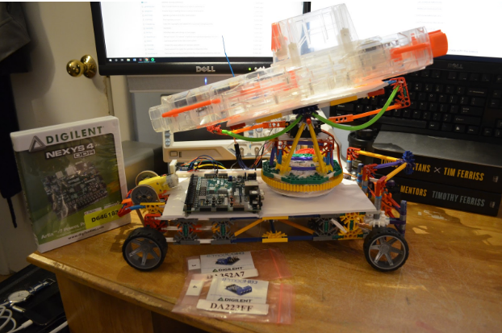

# G3_Frame_Processing_Gun_Automobile
The project was to develop a 4-wheeled vehicle, equipped with a Nerf gun turret capable of aiming with two degrees of freedom (pitch and yaw). The system is controlled remotely via a WiFi connection, allowing two separate users to each control either the driving or turret component. There were separate video cameras attached to the body of the vehicle and the turret, with the two video streams sent independently to the two users. Additionally, there is a custom IP block used to process the video stream from the turret and identify human faces, which are then highlighted on the screen of the turret user.

The project was chosen because it integrates a number of sensors, actuators and IP blocks into a network-connected device. It does this in a way that both makes for an interesting demo, and which has a naturally modular design that allows for relatively easy testing. The main goal of the project was to produce a product that would be suitable to compete against existing RC cars used for entertainment.



The hierarchy of the design tree is as follows:

```
target_recognition_ip/ - the Python, C and verilog for the target recognition IP

target_recognition_ip/python - the Python implementation

target_recognition_ip/{src, include} - the C implementation

target_recognition_ip/verilog - the verilog implementation

target_recognition_ip/Images - images for use for testing, and outputs of various pipeline stages
```

```
client_code/ - the Python code for the client, running on the user's computer
```

```
microblaze_code/ - the C code that runs on the Microblaze, implementing the web server functionality
```
